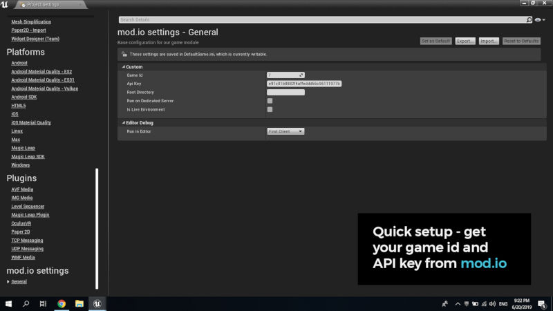

# Mod Support

Our friends at **mod.io** have built a cross-platform modding API, which makes it easy to [add mod support to your game on PC, console and mobile](https://mod.io/), and establish a modding community that can grow your games success with new content for your players.

[Homepage](https://mod.io/) | [Setup your game](https://mod.io/games/add) | [Documentation](https://docs.mod.io/) | [Ask questions on Discord](https://discord.mod.io/)

### Features Include:

- **Platform agnostic** - support 1 click mod installs in-game, no matter where your players come from be it Game Jolt, Steam, console or mobile.
- **Connect your community** - mods are a great way to engage your fans and the mod.io Discord bot makes that easy by sending a notification whenever a mod is added. You can also build your own custom bots and integrations using the mod.io API.
- **Powerful search and categorization** - we know that no two games are the same, which is why you can customize the tags and design of your mod.io page, to suit your style. See how [other games](https://mod.io/games) are using mod.io.
- **Easy moderation** - managing your mod community doesn’t need to be difficult. mod.io provides an easy to use web interface to submit and moderate mods.
- **Detailed analytics** - let your community's creations guide your games development by showing you what they want. Our analytics, rating and reporting tools highlight which mods are popular and being played by your community.
- **Earn revenue from your UGC** - there is no cost to use mod.io as your modding platform. We are working on marketplace functionality which will enable your creators to sell their mods, and if you enable that feature the only cost will be a revenue share from the profit generated by your players UGC transactions.

Once you have made your game moddable, you can integrate mod.io to host the mods your community creates, and using the mod.io API you can make those mods browsable and installable in-game.

### Steps to get started:

- Add your game to the [mod.io test environment](https://test.mod.io/games/add) to get your test API key.
  Integrate mod.io in-game using one of the [open source SDKs](https://github.com/modio) we provide for different engines and programming languages.
- If you have any questions we provide [detailed documentation](https://docs.mod.io/), and our entire team is [available on Discord](https://discord.mod.io/) anytime you need.
- Once you have mods running and installing in-game using mod.io, you should add your game to the [mod.io production environment](https://mod.io/games/add) to get a live API key to use.
- Finally you can launch your game on mod.io, and we will help promote it to millions of players across our network, so you can boost your games success with mods!

If you are interested to see how mod.io looks, here are some screenshots from our Unity and Unreal Engine 4 plugins. Over [39 games use mod.io](https://mod.io/games) on 9 stores to power 200,000 mod installs daily - and we’d love to help your game grow and succeed with mods. Some games have even managed to get mod.io [running in 48 hours during a game jam](https://mod.io/blog/add-mod-support-to-a-unity-game-in-48-hours-with-modio), setup is that simple!

